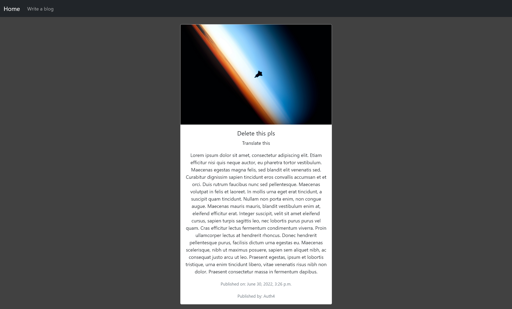

# A simple blog-site using Django

For authentication, Django's in built auth app was used.
Bootstrap 5 was used for styling.

To use, install Django using `pip install Django` to install in the global context 
or visit the [official Django website](https://docs.djangoproject.com/en/4.0/topics/install/) for more options. Then, open the terminal in the folder where you downloaded the code, execute `python manage.py runserver` then follow the link in the terminal.

Screenshots:

Full blog post:
