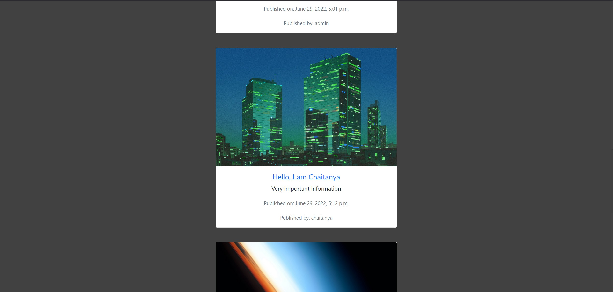
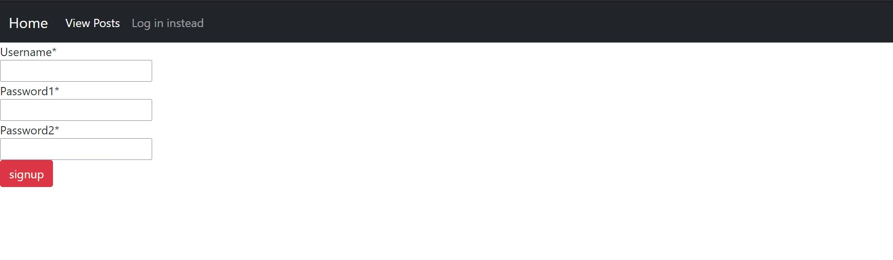

#A simple blog-site using Django

For authentication, Django's in built auth app was used.
Bootstrap 5 was used for styling.

To use, install Django using `pip install Django` to install in the global context 
or visit the [official Django website](https://docs.djangoproject.com/en/4.0/topics/install/) for more options.

Screenshots:

